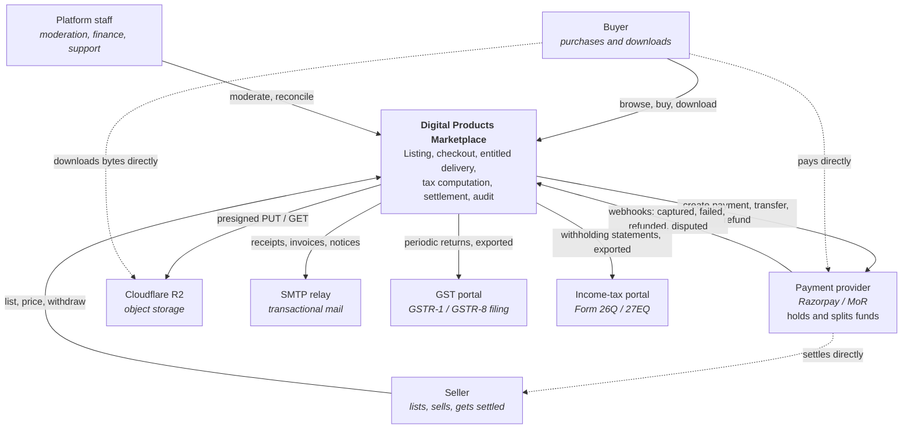

# C4 level 1 — System context

Who uses the system, what it depends on, and — the part context diagrams
usually omit — what deliberately is *not* connected to it.

## The two dotted lines that define the architecture

**`Buyer ⇢ PSP`** and **`PSP ⇢ Seller`** are the most important edges on this
diagram, and neither passes through the system.

Money moves from the buyer to the payment provider, and from the provider to the
seller. The marketplace instructs and records; it never custodies. If those two
lines went through the box in the middle, the platform would be a payment
aggregator under the RBI Directions — needing ₹15–25 crore of net worth, escrow
with a scheduled commercial bank, and, fatally, barred from operating a
marketplace at all (ADR [0003](../adr/0003-never-hold-customer-funds.md)).

**`Buyer ⇢ R2`** matters for a different reason: download bytes never traverse
the application. A 500 MB asset does not occupy a request goroutine or a byte of
egress on the application tier. Delivery capacity is therefore decoupled from
request capacity entirely (ADR [0014](../adr/0014-object-storage-choice.md)).

## External dependencies, and the failure posture toward each

| System | Purpose | If it is down |
|---|---|---|
| Payment provider | Collection, split, transfer, refund | Checkout fails cleanly with a problem document; no order is left in a half-paid state, because the order only advances on a verified capture |
| Cloudflare R2 | Asset storage and delivery | Existing presigned URLs continue to work; new grants fail. Browsing, buying and the ledger are unaffected |
| SMTP relay | Receipts, invoices, password resets | Mail queues in the database and drains on recovery. Nothing in the purchase path blocks on it |
| GST / income-tax portals | Statutory filing | No runtime coupling at all. Returns are generated as exports on a filing cycle |

The tax portals being *export-only* is deliberate. A runtime dependency on a
government portal would mean a portal outage stops commerce; instead the system
computes and records tax obligations continuously and produces filings on
demand.

## What a buyer sees, end to end

1. Browse a catalogue ordered by a formula they can read at `/legal/ranking`.
2. Check out. The system computes tax per line, opens an order, and asks the
   provider for a payment.
3. Pay the provider directly. The provider signs the result.
4. The system verifies the signature, posts the capture to the ledger, issues an
   entitlement, and queues a receipt — all in one transaction.
5. Download against the entitlement, through a short-lived presigned URL with a
   counted quota.

The corresponding webhook arrives independently and is processed idempotently,
so the buyer returning from the payment page and the provider's webhook race
harmlessly: whichever arrives first does the work, and the other is a no-op.

## Trust boundaries

| Boundary | What crosses it | Control |
|---|---|---|
| Internet → API | Every request | TLS, HSTS, nonce CSP, CSRF double-submit with Origin checks, GCRA rate limiting, strict JSON decoding, request-size caps |
| Provider → API (webhook) | Signed events | HMAC over the exact raw body, constant-time compare, replay de-duplication on `(provider, event_id)` |
| API → Provider | Payment instructions | Egress client that refuses redirects and private/loopback/metadata addresses, caps bodies, retries only idempotent requests |
| API → Database | Every query | Parameterised only; `archcheck` fails the build on `fmt.Sprintf` into SQL |
| Buyer → R2 | Asset bytes | Presigned URL, short expiry, quota decremented in the issuing transaction, every issue and denial audited |
| Staff → Admin surfaces | Privileged reads | Fresh server-side role lookup per request; nothing authorising is ever carried in a client-held token |
