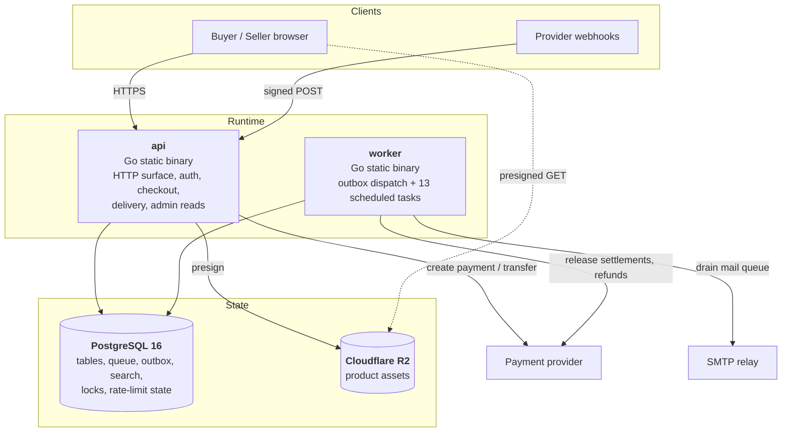

# C4 level 2 — Containers

Two processes, one database, one bucket. The interesting question is not what
these are but why there are not more of them, which
ADR [0001](../adr/0001-modular-monolith-in-go.md) and
ADR [0002](../adr/0002-postgresql-as-the-backbone.md) answer.

## `api`

Serves the HTTP surface and nothing else. Stateless: no session affinity, no
local cache, no background work. Killing an instance mid-request loses that
request and nothing more, because every state change is a committed transaction
or it did not happen.

| Route group | Auth | Notes |
|---|---|---|
| `GET /healthz`, `/readyz`, `/metrics` | none / metrics token | Exempt from rate limiting — load shedding must not blind monitoring |
| `GET /.well-known/security.txt` | none | RFC 9116 |
| `GET /legal/ranking`, `/legal/fees` | none | Generated from the same structs the code uses, so they cannot drift |
| `GET /api/v1/catalog/*` | none | Listing, detail, search |
| `POST /api/v1/auth/*` | none | Register, login, logout, password reset; tighter rate limits |
| `POST /api/v1/checkout`, `/orders/{id}/…` | session | Purchase path |
| `GET /api/v1/library`, `POST …/download/{asset}` | session | Entitlements and grant issue |
| `GET /downloads/{grant}` | grant | Redeems a grant to a presigned redirect |
| `POST /webhooks/payments` | HMAC | Raw-body signature, de-duplicated |
| `GET /api/v1/admin/*` | role | Trial balance, audit verification, outbox status |
| `GET /internal/verify/*` | internal token | Nine consistency checks, for monitoring |

## `worker`

The outbox dispatcher plus thirteen scheduled tasks. Every task is idempotent,
so a duplicate run is a no-op rather than a correction.

| Task | Interval | Purpose |
|---|---|---|
| `release_due_settlements` | 1 min | Releases holds whose protection window closed, skipping disputed orders |
| `complete_protected_orders` | 5 min | Moves orders past the buyer-protection window to complete |
| `ledger_rollup` | 2 min | Advances the balance watermark so reads stay cheap |
| `rollup_turnover` | 1 min | Folds `turnover_deltas` into `seller_fy_gross` |
| `verify_trial_balance` | 5 min | **Asserts debits equal credits per currency** |
| `verify_audit_chain` | 1 hour | **Walks the hash chain and detects tampering** |
| `send_queued_mail` | 15 s | Drains the mail queue over STARTTLS |
| `expire_download_grants` | 10 min | Closes grants past their window |
| `expire_stale_orders` | 5 min | Releases pending orders that were never paid |
| `grievance_sla_watch` | 10 min | Flags grievances approaching their statutory deadline |
| `purge_expired_idempotency_keys` | 1 hour | Bounded retention |
| `prune_login_attempts` | 6 hours | Bounded retention |
| `sweep_expired_sessions` | 1 hour | Bounded retention |

The two `verify_*` tasks are the system's own auditors. They do not repair
anything: they raise, because a trial balance that does not zero means something
bypassed a constraint that should be impossible to bypass, and silently
correcting that would destroy the evidence.

Jitter on every interval prevents a thundering herd when several workers start
together after a deploy.

## PostgreSQL

One primary, doing seven jobs (ADR [0002](../adr/0002-postgresql-as-the-backbone.md)):

- **Tables** — the business state.
- **Queue** — `jobs`, claimed `FOR UPDATE SKIP LOCKED`.
- **Outbox** — `outbox_messages`, claimed the same way, with ordering keys.
- **Search** — `tsvector` + GIN, trigram for fuzzy matching.
- **Locks** — `pg_advisory_xact_lock` for the audit chain and worker leadership.
- **Rate limiting** — `rate_limit_allow()` for the distributed case.
- **Scheduling** — the worker's leader election.

Because all seven live in one transactional context, "the order is paid, the
entitlement exists, the ledger is posted, the receipt is queued, the audit line
is written" is one commit. There is no window in which some of those are true.

## Cloudflare R2

Product assets, addressed over the S3 protocol with hand-implemented SigV4
verified against the AWS reference vector. Zero egress cost is the reason
(ADR [0014](../adr/0014-object-storage-choice.md)); the `filesystem` adapter
exists for local development and production configuration refuses to boot with
it.

## Why not more containers

| Tempting container | Why it is absent |
|---|---|
| Redis | The queue needs transactional enrolment with the business write. Redis cannot provide it, so it would add a consistency boundary, not remove one |
| Kafka / SQS | Does not remove the outbox — the dual-write problem is *before* the broker. Adds a hop. The outbox already carries the right events when an external consumer appears |
| Elasticsearch | `tsvector` is sufficient for this catalogue size, and the curated taxonomy carries more relevance than the matcher does |
| A separate payments service | Would make "post the ledger and advance the order" a distributed transaction. The port already gives the isolation; a network boundary would only remove the atomicity |
| A CDN in front of the API | Nothing cacheable is served by the API. The cacheable bytes are in R2, already behind Cloudflare's edge |

Each of those has a documented trigger for revisiting it. None of the triggers
is "the system got popular"; each is a specific measurement.
