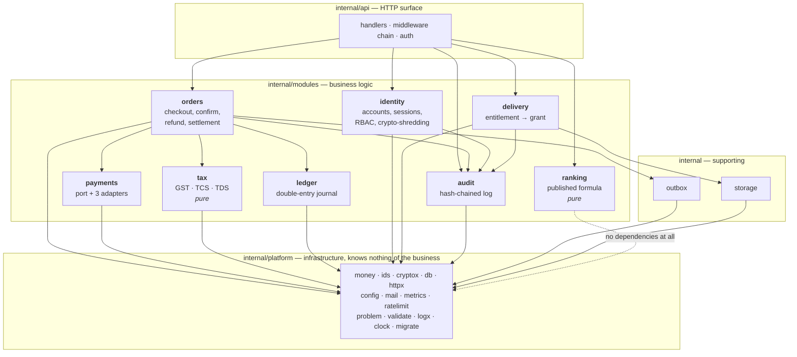

# C4 level 3 — Components

The modules inside `api` and `worker`, and the rule that keeps them modules
rather than directories.

The one arrow that is absent everywhere is `platform → modules`. Infrastructure
never depends on business logic. `archcheck` fails the build if it ever does.

## The enforced dependency matrix

`cmd/archcheck` reads a declared matrix and refuses any import not in it. This is
the full table for the modules that exist today; adding an edge is a visible
edit to that table, which is exactly the kind of change a reviewer notices.

| Module | May import |
|---|---|
| `platform` | *nothing* |
| `ranking` | *nothing* — not even platform |
| `tax` | platform |
| `ledger` | platform |
| `payments` | platform |
| `audit` | platform |
| `outbox` | platform |
| `storage` | platform |
| `identity` | platform, audit |
| `delivery` | platform, audit, storage |
| `orders` | platform, audit, ledger, payments, tax, outbox |

`ranking` importing nothing is the strongest statement in the table. A formula
that must be published and independently reproducible cannot reach for a
database connection, a clock or a config value, because any of those would make
"score this product" depend on something the seller cannot see. The compiler
enforces the property the regulation asks for.

`tax` is pure for the same reason: given a policy, a seller, a buyer and a line,
it returns a breakdown and an `Explain []string` that narrates every step. It
cannot consult anything. That is what makes a 200,000-iteration randomised
conservation test meaningful — there is nothing else for the result to depend on.

`api` and `cmd/*` are exempt from the matrix: composition roots are allowed to
see everything, which is what makes them composition roots.

## Module responsibilities

### `orders` — the transaction script that owns the purchase
Checkout, payment initiation, confirmation, refunds and settlement release.
The largest module, deliberately: the purchase is one business transaction, and
splitting it across services would convert an atomic commit into a saga with
compensations for problems that do not currently exist.

Every state transition writes the status and its timestamp in a single `UPDATE`,
because the schema has a `CHECK` that a paid order must carry a paid timestamp —
two statements would be transiently invalid and, under a deferred check, fatal.

`recordCapture` is shared verbatim by the browser-callback path and the webhook
path. There is exactly one implementation of "a payment was captured", which is
why the two paths racing is harmless.

### `payments` — the port and its adapters
Provider-agnostic interface, typed errors, capability flags, and a hardened
egress HTTP client. See ADR [0006](../adr/0006-payment-provider-port.md).

### `tax` — pure Indirect and direct tax computation
Intra-state (CGST + SGST), inter-state (IGST), export of services, and exempt
supply. TCS under s.52 suppressed for unregistered sellers; s.206AA's 5% rate
when no PAN is on file; the s.194-O threshold for a resident individual or HUF.
`Verify()` re-derives the total from the components and refuses a breakdown that
does not conserve.

### `ledger` — the journal
Post, and read balances. Posting requires a `db.Tx`, not a `db.Querier` —
see below.

### `identity` — accounts and the vault
Registration, Argon2id credentials, sessions, RBAC, TOTP, and the per-subject
key vault that makes erasure possible. Authorisation is always a fresh
server-side lookup, so a stolen session cannot outlive a revocation.

### `delivery` — entitlement to bytes
A single query establishes ownership, licence validity, remaining quota and
asset membership together. Quota is spent at issue, not at redemption, so a
grant that is issued and never used still counts — otherwise a buyer could
harvest unlimited grants.

Denials are recorded *after* the transaction that refused them rolls back, so
evidence of an attempted abuse is not lost with the rollback that caught it.

### `ranking` — the published order
Pure. See ADR [0009](../adr/0009-published-deterministic-ranking.md).

### `audit` — tamper-evident history
Each entry hashes the previous one. `chain_pos` is allocated from a sequence
*inside* an advisory-locked section, because a `BIGSERIAL` default is evaluated
while the tuple is built — before the `BEFORE` trigger fires — so rows would
otherwise take sequence numbers in one order and reach the locked section in
another. Verification walks `chain_pos` and detects both mutation and deletion.

## Three compile-time guarantees worth naming

**You cannot post to the ledger outside a transaction.** `db.Tx` carries an
unexported `inTransaction()` method, so it cannot be implemented or satisfied
outside the `db` package. `ledger.Post` takes a `db.Tx`. An entry written
without its lines is therefore not a runtime error to be caught in review — it
is a compile error.

**You cannot mix currencies.** `money.Money` carries its currency. `Add` on
mismatched currencies returns an error rather than a number, and a ledger line's
currency must match both its account and its entry, checked again in the
database.

**You cannot use `float64` in a money path.** `archcheck` rule 6 fails the build.

## Scale of the implementation

| Area | Go lines |
|---|---|
| `orders` | 4,638 |
| `payments` | 2,819 |
| `identity` | 2,036 |
| `delivery` | 953 |
| `tax` | 901 |
| `ledger` | 808 |
| `ranking` | 598 |
| `audit` | 352 |
| platform, api, worker, outbox, storage, cmd, tests | remainder |
| **Total Go** | **~27,700** |
| **Total SQL (migrations)** | **~3,200** |

## Modules declared but not yet implemented

The dependency matrix also declares `payouts`, `compliance`, `notifications`,
`search`, `disputes`, `admin`, `analytics` and `taxonomy`. Their schema exists in migrations and
their allowed edges are already fixed, so when they are written the boundaries
are decided before the first line of code — which is the point of declaring them
now. Their absence is stated plainly in the repository README rather than
implied by an empty directory.
