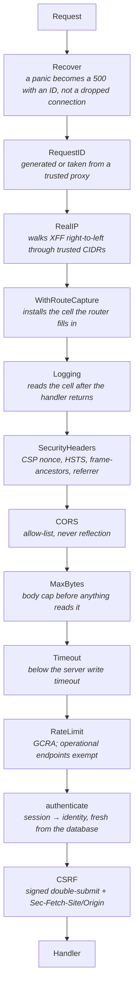

# Request lifecycle

What happens to an HTTP request, in order. The order is load-bearing — three of
the middlewares below are wrong if moved.



## Why the order is what it is

**`Recover` is outermost.** A panic anywhere inside — including inside another
middleware — becomes a 500 carrying a request ID rather than a dropped
connection. `archcheck` also forbids `panic` in request paths, so this is the
second line of defence, not the first.

**`RealIP` precedes rate limiting.** Limiting on the proxy's address would
either limit every user as one or let a single client bypass the limiter by
setting a header. `RealIP` walks `X-Forwarded-For` right-to-left and stops at
the first address that is not in `HTTP_TRUSTED_PROXY_CIDRS`, which is the only
correct direction: an attacker can prepend entries but cannot remove the ones
the trusted proxies appended. Production configuration refuses to start with an
empty trusted-proxy list, because an empty list makes the header authoritative.

**`WithRouteCapture` precedes `Logging`.** Go's `ServeMux` knows the route
template only *after* matching, which happens downstream of every middleware.
Without a mutable cell installed on the way in and read on the way out, every
metric was labelled `"unmatched"` — which is how this was found. The cell is
installed before `Logging` so that `Logging`, reading it after the handler
returns, sees the template the router filled in.

**`MaxBytes` precedes anything that reads a body.** A cap applied after a read
has already lost.

**`RateLimit` precedes `authenticate`.** Authentication is the expensive step —
an Argon2id verification is deliberately ~123 ms — so an unauthenticated flood
must be shed before it reaches that cost.

**`CSRF` is innermost.** It needs the session that `authenticate` resolves.

## Security headers

Content-Security-Policy carries a **per-response nonce**. No `unsafe-inline`, no
`unsafe-eval`, no wildcard host. Every inline script the SSR surface emits
carries the nonce for that response, so a reflected script tag without it does
not execute, and the nonce is useless the moment the response is over.

Also set: `Strict-Transport-Security` (only when the public base URL is HTTPS,
so local development is not poisoned), `X-Content-Type-Options: nosniff`,
`Referrer-Policy`, `X-Frame-Options` with a matching `frame-ancestors`,
`Cross-Origin-Opener-Policy` and `Permissions-Policy`.

## CSRF

Signed double-submit, plus a fetch-metadata check:

1. The cookie is `__Host-`-prefixed — no `Domain`, `Path=/`, `Secure` — so it
   cannot be set by a subdomain, which is the hole in plain double-submit.
2. The token is HMAC-signed and bound to the session, so a token from one
   session is not valid in another.
3. `Sec-Fetch-Site` is checked first; where the browser does not send it,
   `Origin` and then `Referer` are checked against the allow-list.
4. Comparison is constant-time.

Any single one of these can be defeated. Together they require an attacker to
control a subdomain *and* forge a signature *and* suppress fetch metadata.

## Rate limiting

GCRA — a leaky bucket expressed as one timestamp per key, which is why the state
is small enough to keep in process. Sharded by key hash so shards do not contend.

Per-route rules: authentication endpoints are much tighter than catalogue reads,
and the login burst is capped in production configuration (`> 200` is refused,
because a large burst defeats the point).

Exempt: `/healthz`, `/readyz`, `/metrics`, `/.well-known/security.txt` and the
`/internal/verify/` prefix. This exemption came out of the load test — under
shedding, monitoring was being rate-limited at exactly the moment it was needed,
which converts a capacity problem into a blind capacity problem.

`rate_limit_allow()` exists in the database for the multi-instance case, where
per-process limits are N times the intended limit.

## Request body handling

`DecodeJSON` is strict: unknown fields are rejected, trailing content after the
JSON value is rejected, and the reader is the already-capped body. Unknown-field
rejection is not pedantry — it turns a client sending `{"amount": 100, "amout":
50}` into an error instead of a silent zero.

Validation rejects control characters, byte-order marks and bidirectional
override characters (`U+202A`–`U+202E`, `U+2066`–`U+2069`) in user-supplied text.
Those are the characters used to make a filename or a product title render as
something other than what it is.

## Errors

RFC 9457 `application/problem+json` throughout:

```json
{
  "type": "https://<base>/problems/insufficient-entitlement",
  "title": "Insufficient entitlement",
  "status": 403,
  "detail": "This licence does not cover the requested asset.",
  "instance": "/api/v1/library/lic_.../download/ast_...",
  "request_id": "req_..."
}
```

The `type` URI is stable per failure class, so a client can branch on it without
parsing prose. `detail` never leaks internals: a failed login says the same thing
whether the account exists or not, and `DummyVerify` runs an Argon2id hash on the
missing-account path so the timing says the same thing too.

## Authentication and authorisation

A session cookie resolves to an account by a **fresh database lookup on every
request**. No role, entitlement or seller status is ever carried in a token the
client holds. A revoked session dies on its next request; a demoted user loses
access immediately. The cost is one indexed lookup per request; the benefit is
that revocation actually revokes.

## The two capture paths

The browser callback and the provider webhook race by design, and both call the
same `recordCapture`:

| | Callback | Webhook |
|---|---|---|
| Trigger | Buyer returns from the payment page | Provider POSTs |
| Signature | `HMAC(key_secret, "order_id\|payment_id")` | `HMAC(webhook_secret, raw body)` |
| Verified against | Provider-documented payload | The exact bytes received, before any decode |
| De-duplication | Ledger idempotency key | `(provider, event_id)` unique, then the same key |

Two different secrets over two different payloads. Conflating them is a real
vulnerability, so the adapter keeps them apart and the webhook handler reads the
body once into a buffer — the verified bytes and the parsed bytes are provably
the same bytes, because re-serialising JSON changes them.

Whichever path arrives first does the work. The other finds the idempotency key
taken and returns success without repeating it.
