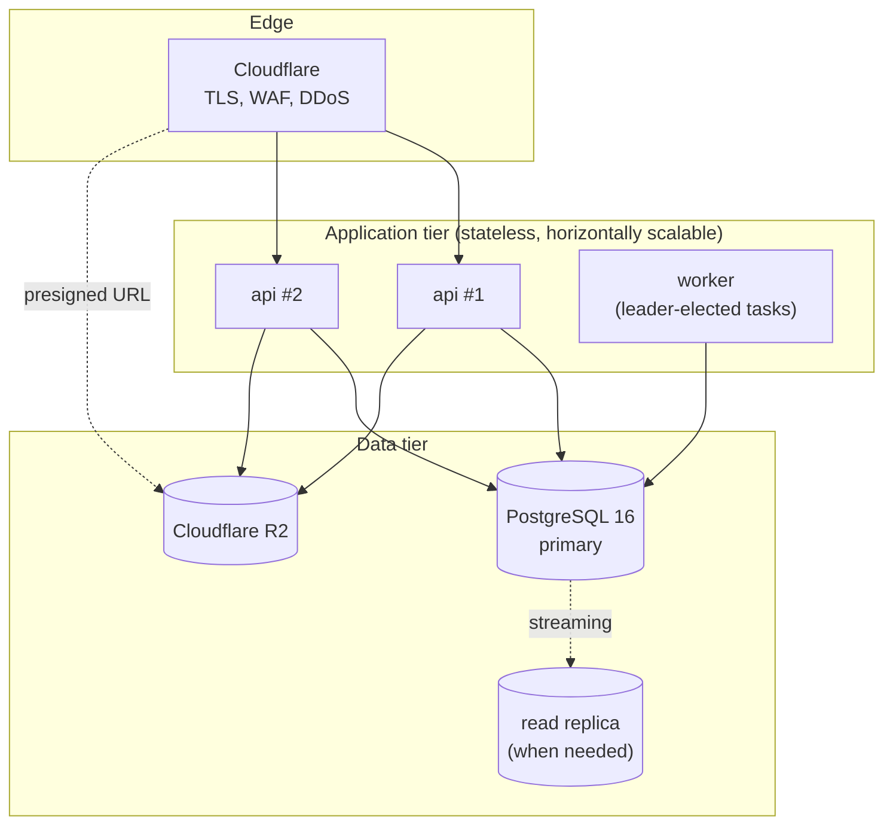

# Architecture

This directory describes the system as it is built. It follows the
[arc42](https://arc42.org/) skeleton, with the C4 levels in separate files
because they are the parts people actually come here to read.

| Document | Answers |
|---|---|
| [01-context.md](01-context.md) | Who uses the system and what it talks to (C4 L1) |
| [02-containers.md](02-containers.md) | What processes exist and why exactly these (C4 L2) |
| [03-components.md](03-components.md) | The module map and the enforced dependency matrix (C4 L3) |
| [04-money-flow.md](04-money-flow.md) | Every rupee, from checkout to settlement, with its ledger postings |
| [05-data-model.md](05-data-model.md) | The schema, and which invariants the database enforces itself |
| [06-request-lifecycle.md](06-request-lifecycle.md) | What happens to an HTTP request, in order |
| [07-failure-modes.md](07-failure-modes.md) | What breaks, what happens, and how it is detected |

Decisions and their reasoning live in [../adr](../adr). This directory says
*what*; the ADRs say *why*, and where the two disagree the ADRs are the record.

---

## 1. Introduction and goals

An India-first marketplace for digital products — templates, presets, fonts,
courses, code, audio — where a seller keeps a predictable share and a buyer gets
what they paid for.

Three quality goals drive every structural decision, in this order:

1. **Correctness of money.** A rupee is never invented, lost, or rounded into
   existence. This outranks availability: refusing a payment is recoverable,
   mis-settling one is not.
2. **Regulatory defensibility.** Payment-aggregation rules, GST and income-tax
   withholding, e-commerce consumer rules, and personal-data law each constrain
   the design. Each constraint is implemented as a structural property rather
   than a procedure someone has to follow.
3. **Seller trust.** Fees, ranking and settlement timing are published,
   computable, and enforced by constraints rather than promised in copy.

Performance is a constraint, not a goal: the system must handle launch-scale
load on inexpensive hardware. It does — see
[../operations/capacity.md](../operations/capacity.md).

### Stakeholders

| Stakeholder | What they need from the architecture |
|---|---|
| Buyer | Pays once, receives the file, can prove what they bought |
| Seller | Predictable economics, an explainable listing position, settlement on a stated date |
| Platform operator | Reconciles to the paisa, can answer any regulator's question from data |
| Tax authority | Correct GST, TCS under s.52, TDS under s.194-O, retained records |
| Payment provider | A well-behaved integrant that verifies signatures and is idempotent |
| Data-protection regulator | Erasure honoured without destroying statutory records |

## 2. Constraints

**Regulatory** — the binding ones, each with its architectural consequence:

| Constraint | Consequence | Record |
|---|---|---|
| RBI PA Directions 2025 — non-bank PAs need ₹15–25 crore net worth, escrow, and may not run a marketplace | The platform is never in the flow of funds. No wallet exists, and the schema refuses to create one | [0003](../adr/0003-never-hold-customer-funds.md), [0011](../adr/0011-settlement-holds-not-wallets.md) |
| Razorpay Route needs ₹40 lakh evidenced turnover | Launch runs a bridge adapter behind the same port; eligibility is computed from the turnover rollup | [0006](../adr/0006-payment-provider-port.md) |
| GST: 18% on the platform's commission; TCS 1% u/s 52; TDS 0.1% u/s 194-O | Tax is computed per line by a pure function with a conservation check, never as an afterthought | [0004](../adr/0004-money-as-integer-minor-units.md) |
| DPDP 2023 / GDPR erasure vs. 6–8 year statutory retention | Crypto-shredding: destroy the key, keep the record | [0008](../adr/0008-crypto-shredding-for-erasure.md) |
| EU P2B Art. 5, DSA, India CP (E-Commerce) Rules 2020 | A published, reproducible ranking formula | [0009](../adr/0009-published-deterministic-ranking.md) |
| Consumer protection on digital goods | Disclosure-first provenance; publish-time asset guarantees in triggers | [0010](../adr/0010-disclosure-first-provenance.md) |

**Technical**, self-imposed, and each defensible:

- One stateful dependency: PostgreSQL 16. Object storage is the sole exception.
- Five Go modules in `go.mod`. Dependency surface is attack surface.
- Two binaries: `api` and `worker`, from one codebase.
- No floating point anywhere near money.
- Everything that can be checked at compile time is checked at compile time.

## 3. Solution strategy

| Problem | Approach | Where |
|---|---|---|
| Money must not be wrong | Integer minor units, 128-bit intermediates, explicit rounding, conserving allocation | `internal/platform/money` |
| Money must be traceable | Append-only double-entry journal with a database-enforced balance constraint | `internal/modules/ledger` |
| Never hold funds | Provider-side split, or settlement holds and offsets | `internal/modules/payments`, `orders` |
| Dual writes | Transactional outbox, idempotent consumers | `internal/outbox` |
| Erasure vs. retention | Per-subject keys, erasure by key destruction | `internal/modules/identity` |
| Boundaries eroding | Build-time architecture fitness functions | `cmd/archcheck` |
| Concurrency | READ COMMITTED with an explicit locking contract, proven under load | `internal/platform/db` |

## 4–6. Context, containers, components

See [01-context.md](01-context.md), [02-containers.md](02-containers.md) and
[03-components.md](03-components.md).

## 7. Deployment view

Two stateless binaries plus one PostgreSQL primary plus one R2 bucket.

`api` instances are interchangeable: no sticky sessions, no local state, no
in-memory cache that would need invalidating. Sessions are database rows, so a
buyer's request may land anywhere.

`worker` runs the dispatcher on every instance — `SKIP LOCKED` makes that
safe — and scheduled tasks behind a leader advisory lock, so running several
workers duplicates nothing.

Download bytes never traverse the application tier: a presigned URL sends the
buyer straight to R2 (ADR [0014](../adr/0014-object-storage-choice.md)).

## 8. Cross-cutting concepts

| Concept | Realisation |
|---|---|
| Identity | UUIDv7 internally, Crockford-base32 prefixed public IDs externally (`prd_…`, `ord_…`) |
| Time | Injected clock everywhere; `archcheck` fails a build that calls `time.Now()` in business logic |
| Errors | RFC 9457 `application/problem+json`, with a stable `type` URI per failure class |
| Idempotency | Database constraints, not application checks |
| Audit | Hash-chained append-only log, verified hourly |
| Rate limiting | GCRA, sharded in-process, with a database function for the distributed case |
| Secrets | Environment-injected, validated at boot, never logged |
| Configuration | Fail-fast: an unsafe production setting refuses to start the process |

## 9. Architecture decisions

Fifteen records in [../adr](../adr). Start with
[0003](../adr/0003-never-hold-customer-funds.md) — most of the rest follow from
it.

## 10. Quality requirements

| Attribute | Requirement | Verified by |
|---|---|---|
| Money correctness | No rupee created or destroyed under any operation | 70k-iteration property tests; 200k-iteration tax conservation test; continuous trial balance |
| Auditability | Every economic event reconstructible and tamper-evident | Hash chain verification, hourly, plus a test that detects both mutation and deletion |
| Throughput | ≥ 1,000 read req/s on 4 cores | Measured 2,885 req/s, p99 55 ms |
| Commerce throughput | ≥ 20 purchases/s | Measured 53.9/s, zero errors |
| Availability under load | No error amplification from contention | Zero 5xx across both stress paths after the ADR 0012 changes |
| Security | No injectable query, no unsafe-inline CSP, no reflected CORS | `archcheck` rules 7–8, header assertions in the e2e suite |

## 11. Risks and technical debt

| Risk | Status |
|---|---|
| KEK loss destroys all personal data | Accepted, mitigated by KMS custody and named in the runbooks |
| Single PostgreSQL primary is the write ceiling | Accepted; replicas and partitioning are available before it binds |
| Bridge adapter is a commercial stopgap | Bounded by the port; eligibility for Route is computed continuously |
| Provenance signal extractors not yet implemented | Fails safe — every listing routes to human review until they land |
| Chargebacks after settlement release against dormant sellers | Bounded, measurable from the ledger, offset against future settlement |

## 12. Glossary

| Term | Meaning |
|---|---|
| **Minor unit** | The smallest indivisible unit of a currency — paise for INR. All money is an integer count of these |
| **Blind index** | A keyed hash stored beside a ciphertext so exact-match lookup works without plaintext |
| **Crypto-shredding** | Erasure by destroying the decryption key rather than the ciphertext |
| **Protection window** | The period after capture during which a seller's share is transferred but held unsettled |
| **Outbox** | A table of publications written in the same transaction as the state change that caused them |
| **GCRA** | Generic Cell Rate Algorithm — a leaky bucket expressed as one timestamp per key |
| **Gapless series** | A number sequence with no holes, required by statute for tax invoices |
| **TCS / TDS** | Tax Collected at Source (GST s.52) / Tax Deducted at Source (income tax s.194-O) |
