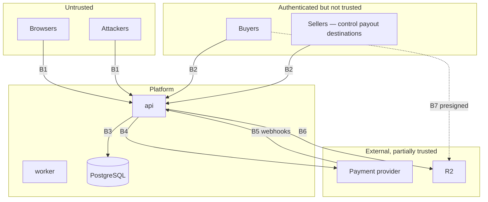

# Threat model

STRIDE, applied to the assets that matter, with the control that addresses each
threat and the file it lives in. A threat with no named control is listed as
open rather than omitted.

## Assets, ranked by what losing them costs

| # | Asset | Loss looks like |
|---|---|---|
| 1 | **Funds in flight** | A seller settled to the wrong account; a buyer charged and not delivered |
| 2 | **The ledger and audit log** | The business cannot be reconciled or defended to a regulator |
| 3 | **Buyer and seller personal data** | DPDP/GDPR exposure, and a permanent loss of trust |
| 4 | **Product assets** | The thing sellers came here to sell is copied for free |
| 5 | **Credentials and sessions** | Everything above, through the front door |
| 6 | **The KEK** | Every subject's personal data at once |

## Trust boundaries

A seller is **authenticated but not trusted**. They control a payout destination,
which makes seller account takeover the highest-value attack on the system. That
is why seller 2FA cannot be disabled in production — the configuration loader
refuses to start.

---

## S — Spoofing

| Threat | Control | Where |
|---|---|---|
| Credential stuffing | Argon2id (64 MiB, t=2, p=1); per-IP and per-account GCRA limits; login burst capped at 200 in production | `platform/cryptox/password.go`, `platform/ratelimit` |
| User enumeration via login | Identical response for missing and wrong; `DummyVerify` runs a real hash on the missing path so timing matches | `cryptox/password.go` |
| User enumeration via registration or reset | Same response whether or not the address exists; the mail differs, not the response | `identity/credentials.go` |
| Session token theft | `__Host-` cookie, `Secure`, `HttpOnly`, `SameSite=Lax`; server-side revocation effective on the next request | `httpx/security.go`, `identity/service.go` |
| Session fixation | A new session identifier is issued on every privilege change | `identity/service.go` |
| Seller account takeover → payout redirect | TOTP mandatory for sellers, unconditionally in production; payout changes re-authenticate and are audited | `config`, `identity/service.go` |
| Forged payment webhook | HMAC over the **exact raw body**, constant-time compare, per-provider secret | `payments/razorpay.go`, `payments/mor.go` |
| Forged checkout callback | A **different** HMAC — `key_secret` over `order_id\|payment_id`. Never interchangeable with the webhook scheme | `payments/razorpay.go` |
| Client IP spoofing via XFF | Right-to-left walk stopping at the first untrusted hop; production refuses an empty trusted-CIDR list | `httpx/middleware.go`, `config` |
| Replayed MoR webhook | Timestamp inside the signature, bounded replay window | `payments/mor.go` |

## T — Tampering

| Threat | Control | Where |
|---|---|---|
| Altering a ledger entry | `UPDATE`/`DELETE` raise; corrections are compensating entries | `0004_ledger.sql` |
| Altering an audit entry | Hash chain over `chain_pos`, allocated inside an advisory lock; verified hourly | `0001`, `0012`, `modules/audit` |
| Unbalanced entry written directly | Deferred constraint trigger; proven by a test that bypasses Go | `0004_ledger.sql` |
| SQL injection | Parameterised queries only; `archcheck` fails the build on `fmt.Sprintf` into SQL | `cmd/archcheck` |
| Price tampering in checkout | Prices are read server-side from the catalogue; the client sends identifiers and quantities, never amounts | `orders/checkout.go` |
| Tax tampering | Computed server-side by a pure function that verifies its own conservation | `modules/tax` |
| Object-key traversal | `ValidateKey` rejects traversal, absolute paths, control characters, empty segments; keys derive from server-generated identifiers | `storage/storage.go` |
| Homoglyph / bidi text attacks | Control characters, BOM and `U+202A`–`U+202E`, `U+2066`–`U+2069` rejected in user text | `platform/validate` |
| Request-body smuggling | Strict JSON decode: unknown fields and trailing content rejected | `httpx/middleware.go` |

## R — Repudiation

| Threat | Control | Where |
|---|---|---|
| "I never authorised that payout" | Every state change audited with actor, IP, user agent and timestamp, hash-chained | `modules/audit` |
| "The platform altered my settlement" | Journal is append-only; a statement is produced from it, not from application logic | `modules/ledger` |
| "I was never shown that fee" | The schedule in force is a row with an announcement date, enforced by the 90-day constraint | `0008_compliance_ranking.sql` |
| "My listing was demoted deliberately" | The ranking formula is pure, published and reproducible by the seller | `modules/ranking` |
| Staff action denied | Admin surfaces are audited identically to user actions; there is no unaudited path | `modules/audit` |

## I — Information disclosure

| Threat | Control | Where |
|---|---|---|
| Database exfiltration exposing personal data | Everything personal is AES-256-GCM under a per-subject DEK; the database holds no plaintext | `identity/crypto.go` |
| Blind index reversal | HMAC under a KEK-derived pepper; leaks equality only, and a rainbow table needs the pepper | `identity/crypto.go` |
| Ciphertext moved between fields or people | Subject ID and field name bound in as AAD | `identity/crypto.go` |
| Asset URL sharing | Presigned, short-lived (`DOWNLOAD_URL_TTL` is capped), quota decremented at issue, every issue and denial audited | `modules/delivery` |
| Enumerating orders or products by ID | Public IDs are 26 Crockford characters over ~128 bits; every access is authorised regardless | `platform/ids` |
| Metrics exposed publicly | `METRICS_TOKEN` required in production | `config` |
| Error messages leaking internals | RFC 9457 problems with a fixed `detail` per class; internals go to logs with a request ID | `platform/problem` |
| Secrets in logs | Structured logging with explicit field allow-lists; secrets are never fields | `platform/logx` |
| SSRF against internal services | Egress client refuses redirects and private/loopback/link-local/metadata addresses | `payments/httpclient.go` |
| Timing disclosure on token comparison | `subtle.ConstantTimeCompare` for every secret comparison, including TOTP across the skew window | `cryptox` |

## D — Denial of service

| Threat | Control | Where |
|---|---|---|
| Request flood | GCRA per route class, sharded in-process | `platform/ratelimit` |
| **Argon2id resource exhaustion** | Rate limiting *before* authentication in the chain; login burst capped at 200 in production; `p=1` so one hash cannot saturate the box | `api/server.go`, `config` |
| Large request bodies | `MaxBytes` before any read | `httpx/middleware.go` |
| Slowloris | Server read/write/idle timeouts, plus a per-request timeout below the write timeout | `api/server.go` |
| Large provider responses | 4 MB cap on the egress client | `payments/httpclient.go` |
| Connection-pool exhaustion | Bounded pool; bounded transaction retries so a stuck request frees its connection | `platform/db` |
| Hot-row contention collapsing throughput | Append-only deltas plus rollups for ledger balances and turnover; `SKIP LOCKED` for queues | `0011_contention.sql` |
| Monitoring shed under load | Operational endpoints exempt from rate limiting | `api/server.go` |
| Storage cost attack (repeated downloads) | Per-grant quota, spent at issue so unredeemed grants still count | `modules/delivery` |

## E — Elevation of privilege

| Threat | Control | Where |
|---|---|---|
| Role escalation via a token | No role is ever in a client-held token; every check is a fresh server-side lookup | `identity/service.go` |
| Horizontal access (another user's order) | Ownership is part of the query, never a check after the fetch | `orders/repository.go`, `delivery` |
| Downloading without entitlement | One query establishes ownership, licence validity, quota and asset membership together | `modules/delivery` |
| CSRF into a privileged action | `__Host-` signed double-submit bound to the session, plus `Sec-Fetch-Site`/`Origin`/`Referer` | `httpx/security.go` |
| XSS → session theft | Nonce CSP with no `unsafe-inline`/`unsafe-eval`; `HttpOnly` cookies; contextual escaping | `httpx/security.go` |
| CORS reflection | Static allow-list; the request `Origin` is never echoed | `httpx/security.go` |
| Malicious upload executing | ClamAV scan over the real INSTREAM protocol **plus** independent magic-byte detection; the publish trigger refuses any asset not scanned clean; assets served from a separate origin with `Content-Disposition: attachment` | `internal/antivirus`, `0005_catalog.sql` |
| An executable dressed as a font, image or archive | Magic-byte detection compares content against the declared extension and refuses every executable format outright — this does not depend on a signature feed being current | `internal/antivirus/magic.go` |
| A scanner outage read as "clean" | `StatusError` and `StatusSkipped` are both unpublishable; an unreachable scanner returns `ErrUnavailable`, never a verdict | `internal/antivirus` |
| Privilege gained by switching provider at runtime | The adapter is chosen once at boot from validated configuration; there is no runtime switch, so a compromised admin session cannot redirect settlement | `payments/registry.go` |

---

## Configuration as a control

Nineteen settings that are merely unwise in development are **fatal at boot** in
production. This is a security control, not ergonomics: the most common way a
secure system becomes insecure is a deployment that forgot a flag.

Production refuses to start with: a non-HTTPS base URL; `SECURE_COOKIES=false`;
HSTS under 180 days; the filesystem storage driver; `MAIL_DRIVER=log`;
`sslmode=disable`; a missing `PLATFORM_GSTIN` or `METRICS_TOKEN`; a Razorpay Route
configuration missing any of its three secrets; a non-HTTPS provider base URL;
`PAYMENTS_ALLOW_LOOPBACK_PROVIDER=true`; `SETTLEMENT_HOLD_DAYS < 7`;
`RATE_LIMIT_LOGIN_BURST > 200`; `REQUIRE_2FA_SELLERS=false`;
`ANTIVIRUS_DRIVER` anything but `clamav`; an empty
`HTTP_TRUSTED_PROXY_CIDRS`; a `DOWNLOAD_URL_TTL` that is too long; a key that is
not exactly 32 bytes; or a commission outside 0–30%.

## Known residual risks

Stated plainly, because a threat model that claims none is not finished.

| Risk | Why it is accepted | Mitigation |
|---|---|---|
| **KEK compromise decrypts everything** | Concentration is the price of instant, backup-inclusive erasure | KMS/HSM custody, access audit, documented rotation that re-wraps DEKs |
| **Presigned URLs are bearer tokens for their lifetime** | The alternative is proxying bytes, which reintroduces the egress cost the model depends on | Short TTL, quota spent at issue, every issue and denial audited |
| **A single database is a single point of failure** | Consequence of ADR 0002, taken knowingly | Replication, PITR, documented failover |
| **The bridge adapter reconciles payouts separately** | Route is not commercially available yet | Ledger reconciliation, continuous eligibility evaluation, a port that makes the switch a configuration change |
| **Provenance extractors not yet implemented** | Unfinished, not unsafe | Fails toward human review rather than auto-publication |
| **In-process rate limiting is per-instance** | Correct for one instance; N instances give N× the limit | `rate_limit_allow()` exists for the distributed case |
| **No WAF rules of our own** | Cloudflare sits in front | Application controls do not assume it |

## What has been verified, and how

| Control | Verification |
|---|---|
| Ledger balance enforcement | A test writes an unbalanced entry in raw SQL and asserts refusal |
| Append-only journal and audit log | Tests attempt `UPDATE` and `DELETE` and assert refusal |
| Audit chain tamper detection | 16×25 concurrent writers, then mutation and deletion, both detected |
| Idempotent capture | 24 goroutines on one key produce exactly one entry |
| Money conservation | 70,000 randomised property-test iterations |
| Tax conservation | 200,000 randomised iterations |
| SigV4 correctness | The official AWS reference vector, including the range-header case |
| Race freedom | `-race` across the concurrency-critical packages |
| Architecture rules | `archcheck` over 87 files, 12 justified exemptions |
| Behaviour under load | Stress test; six real concurrency defects found and fixed |

The last line is the one that matters most: every one of those six defects was
invisible to review and to single-threaded tests.
